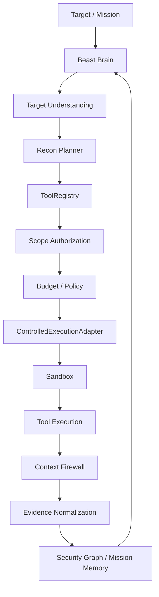

# AI Autonomous Bug Hunter — Beast Brain

An AI-driven autonomous security research and authorized vulnerability-hunting framework built around a single continuous reasoning system.

⚠️ **Authorization / Legal Notice**: Beast Brain is intended for authorized security research, defensive testing, CTF/lab environments, and systems for which the operator has explicit permission to test. Installing a security tool does not grant authorization to use it against a target.

## Overview
Beast Brain is NOT a collection of independent agents or a "multi-agent swarm." It is a unified intelligence system that sequentially reasons through attack surfaces, executes safe reconnaissance, tests hypotheses, and models vulnerabilities without losing state or entering rogue agent loops.

## What Makes Beast Brain Different
Instead of blindly throwing thousands of payloads or dividing tasks among a chaotic swarm of agents, Beast Brain operates via a **Single Continuous Reasoning** architecture. It treats security testing as a scientific process: discovering assets, building an evidence-based graph, formulating testable hypotheses, validating them securely, and iterating based on exact findings.

## Core Architecture
Beast Brain relies on an unbreakable execution pipeline:



## Security Architecture
Security is hardcoded directly into the architecture:
- **Cryptographic Scope Certificates**: Target allowlists are enforced via HMAC-SHA256 signatures, ensuring strictly authorized synthetic loopback/local boundaries.
- **Fail-Closed Sandbox**: Commands run inside POSIX resource limit sandboxing (`RLIMIT_AS`, `RLIMIT_CPU`, etc.).
- **Context Firewall**: Strips prompt injections from untrusted tool outputs.
- **Secret Redaction**: Multi-cloud and credential regex sanitizers run pre-persistence.
- **Tamper-Evident Audit Chains**: Every action hashes deterministically.
- *Note: Installed tool ≠ Authorized tool execution.* Beast Brain mediates all execution via centralized Trust Tiers (`VALIDATED`, `HIGH_RISK`, etc.).

## Reconnaissance Intelligence
Recon is an iterative capability, not a one-time startup script.
1. **Target Classifier**: Determines if the asset is WEB, API, CLOUD, ANDROID, NETWORK, CONTAINER, SOURCE_CODE, KUBERNETES, or DNS.
2. **Recon Planner**: Adapts execution dynamically based on the existing Security Graph and tool availability.
3. **WAF Awareness**: Detects CDN/WAF blocks and gracefully re-plans without unbound aggressive loops.
4. **Adaptive Re-entry & Stopping**: Detects when enough information is gained, deduplicates observations across iterations, and safely halts execution.

## Supported Target Classes
- WEB
- API
- CLOUD
- ANDROID
- NETWORK
- SOURCE_CODE
- CONTAINER
- KUBERNETES
- DNS

## Universal Tool Provisioning
Beast Brain dynamically detects its environment to manage tools via a layered, idempotent installer:
- Config-driven via `config/tools-manifest.yaml`.
- Fully Root/User-aware (no silent `sudo`).
- Conducts independent validation of every binary upon install.
- Locally managed state outputted directly to `state/tool-status.json`.

## OpenCode Integration
Project-local configuration seamlessly bridges the environment with OpenCode workflows via `.opencode/config.json`. This approach guarantees global user parameters are never unnecessarily hijacked.

## Project Structure
```text
ai-hunter/
├── config/       # Tool manifests and environment policies
├── docs/         # Documentation and phase reports
├── runtime/      # Beast Brain core logic (recon, tools, scope, graph)
├── scripts/      # Provisioning, bootstrap, and health scripts
├── skills/       # Security reasoning workflows and JSON schemas
├── state/        # Local database and tool availability status
├── tests/        # 1,100+ comprehensive validation tests
├── .opencode/    # OpenCode integration configuration
└── README.md
```

## Installation
Clone the repository and bootstrap the environment:
```bash
git clone <repository>
cd ai-hunter
./scripts/bootstrap.sh
```

## Tool Health & Status
Check system readiness and provisioning status at any time:
```bash
./scripts/hunter.sh status
```

Or verify overall health:
```bash
./scripts/hunter.sh doctor
```

Remediate missing tools automatically:
```bash
./scripts/provision_tools.sh
```

## Adaptive Research Loop
```text
Recon discovers asset
        ↓
Graph updated
        ↓
Brain reevaluates
        ↓
New hypothesis
        ↓
Required capability selected
        ↓
Tool execution
        ↓
Evidence
        ↓
Graph update
        ↓
Next hypothesis
```

## Testing
The Beast Brain repository enforces strict testing standards. Run the regression suite locally:
```bash
source .venv/bin/activate
pytest tests/ -q
```

## Current Status
- **Phase 10 — Recon Intelligence**: VERIFIED
- **Phase 10.5 — Tool Provisioning & OpenCode Integration**: READY
- **Regression**: 1,137 / 1,137 passing

## Known Limitations
- Rootless OCI (Docker/Podman) and gVisor (`runsc`) are safely gated. They intentionally fall back to local POSIX rlimits on host environments where those binaries are missing.
- External target engagement is intentionally blocked by strict policy and authorization boundaries.

## Development Roadmap
**Implemented:**
- Single continuous reasoning system
- Cryptographic scope authorization
- Context firewall & secret redaction
- Tamper-evident audit trails
- Reconnaissance Intelligence loop
- Config-driven Tool Provisioning

**Planned:**
- Deeper attack-surface modeling
- Business-logic reasoning
- Advanced hypothesis generation
- Source/black-box correlation

## Contributing
Contributions must strictly preserve the fail-closed security architecture, scope authorization bounds, and the `ToolRegistry` enforcement layer. A multi-agent framework pull request will be explicitly rejected.

## Security
To report a vulnerability in Beast Brain itself, please reach out via standard repository issues or review our upcoming `SECURITY.md` (Currently in development).

## License
*Currently, no license is declared. Please do not redistribute without authorization.*